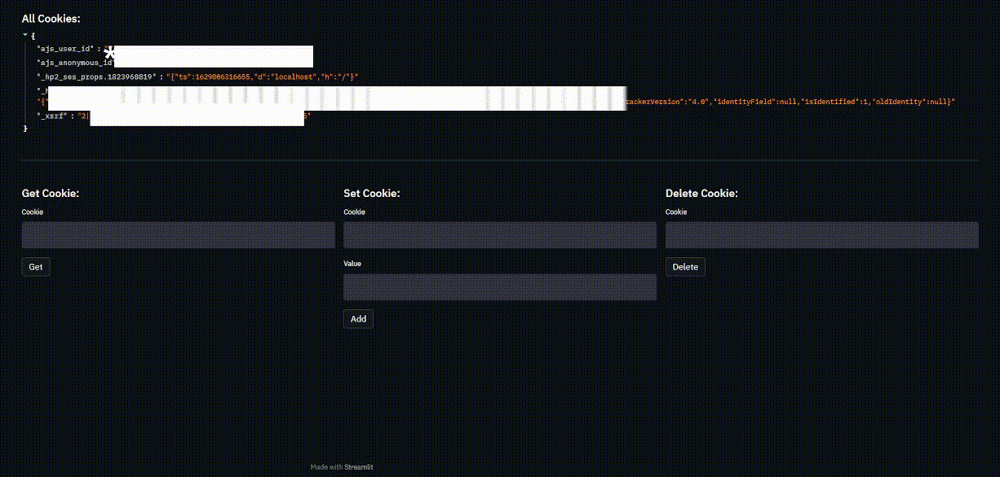
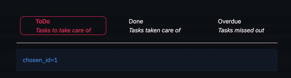
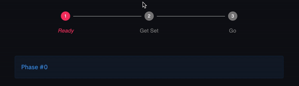

# Extra-Streamlit-Components

[](https://pepy.tech/project/extra-streamlit-components)

An all-in-one place, to find complex or just not available components by default on streamlit.

_Explained in details in my book [Web Application Development with Streamlit](https://amzn.to/3RQZiEa)_

<a href="https://amzn.to/3RQZiEa"> 


## Components

Firstly, add `import extra_streamlit_components as stx`

- ### Router
- Route to specific pages in Streamlit. This leverages the use of query parameters to make custom routes in your Streamlit application. For best experience, make sure to include the st.cache function decorator while initializing the Router object.
  ```python
    @st.cache(allow_output_mutation=True, hash_funcs={"_thread.RLock": lambda _: None})
    def init_router():
        return stx.Router({"/home": home, "/landing": landing})

    def home():
        return st.write("This is a home page")

    def landing():
        return st.write("This is the landing page")

    router = init_router()
    router.show_route_view()

    c1, c2, c3 = st.columns(3)

    with c1:
        st.header("Current route")
        current_route = router.get_url_route()
        st.write(f"{current_route}")
    with c2:
        st.header("Set route")
        new_route = st.text_input("route")
        if st.button("Route now!"):
            router.route(new_route)
    with c3:
        st.header("Session state")
        st.write(st.session_state)
  ```

- ### Cookie Manager
  The long awaited between-sessions in-browser cookies store and manager! It stores cookies in a strict same-site behaviour. 

  To add an expiry date to a cookie use the `expires_at` parameter in the set function. By default, it will expire after 1 day.
  
  **Security Note:** _In shared domains such as share.streamlit.io, other web developers can have access to the cookies you set and the same goes for you. This is not to be treaded as security bug but a circumstance the developer need to be aware of._
  
    ```python
    import datetime
    st.write("# Cookie Manager")

    @st.cache(allow_output_mutation=True)
    def get_manager():
        return stx.CookieManager()

    cookie_manager = get_manager()

    st.subheader("All Cookies:")
    cookies = cookie_manager.get_all()
    st.write(cookies)

    c1, c2, c3 = st.columns(3)

    with c1:
        st.subheader("Get Cookie:")
        cookie = st.text_input("Cookie", key="0")
        clicked = st.button("Get")
        if clicked:
            value = cookie_manager.get(cookie=cookie)
            st.write(value)
    with c2:
        st.subheader("Set Cookie:")
        cookie = st.text_input("Cookie", key="1")
        val = st.text_input("Value")
        if st.button("Add"):
            cookie_manager.set(cookie, val, expires_at=datetime.datetime(year=2022, month=2, day=2))
    with c3:
        st.subheader("Delete Cookie:")
        cookie = st.text_input("Cookie", key="2")
        if st.button("Delete"):
            cookie_manager.delete(cookie)
    ```

  

- ### TabBar
  Inspire from React's `ScrollMenu`, this component receives a list of `TabBarItemData`, and returns the `id` of the
  selected tab
  ```python
  chosen_id = stx.tab_bar(data=[
      stx.TabBarItemData(id=1, title="ToDo", description="Tasks to take care of"),
      stx.TabBarItemData(id=2, title="Done", description="Tasks taken care of"),
      stx.TabBarItemData(id=3, title="Overdue", description="Tasks missed out"),
  ], default=1)
  st.info(f"{chosen_id=}")
  ```

  

- ### BouncingImage
  Probably not the best naming but this component, renders an image by its path or url, and animates by zooming in and
  out repetitively giving an illusion of a bounce.

  ```python
  image_url = "https://streamlit.io/images/brand/streamlit-logo-secondary-colormark-darktext.svg"
  stx.bouncing_image(image_source=image_url, animate=True, animation_time=1500, height=200, width=600)
  ```
  

- ### StepperBar
  A streamlit wrapper on MaterialUI's Stepper

  ```python
  val = stx.stepper_bar(steps=["Ready", "Get Set", "Go"])
  st.info(f"Phase #{val}")
  ```
  


[](https://www.buymeacoffee.com/mohamed512)
